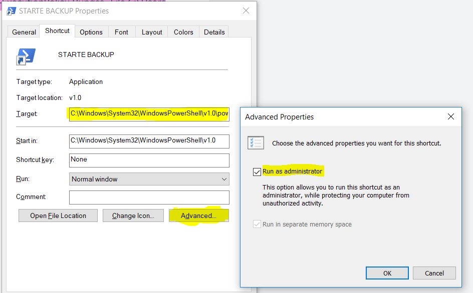

# Corona4Backup
Let's use the corona pandemic time and backup your (and your loved ones) data

This repo shall be a place to collect scripts and tooling to do your backups a bit easier.

## Backup your mum's windows
Since mothers are usually not the top backup euphorics it helps if we give them something click-able which does backups more or less on its own.
### Define some copy rules
As shown in the below example you can use **Backup_Your_Mums_Windows/Backup.csv** to define in a SOURCE|DIRECTORY way which files need be copied from where to where.

```
"ORIGINAL","BACKUP"
"C:\Users\Mum\Desktop","Desktop"
"C:\Users\Mum\Music","Music"
```

In this case all files from C:\Users\Mum\Desktop are copied to the Desktop directory on the backup disk and all files from C:\Users\Mum\Music to the Music directory on the backup disk.

### Start the backup with a powershell script
To start the backup you have to run the script **Backup_Your_Mums_Windows/Backup.ps1** .
This script will:
- open a windows directory dialog to give your mum the possibility to select her backup drive
- abort everything if your somehow select c:\ as backup drive (how could this ever happen ;) )
- show your mum the backup drive she selected and asks her to confirm this choice
- start the backup
   - loop over all lines in your csv file and start a robocopy to mirror all ORIGINAL paths to the BACKUP paths.

### Example
Let's say your mum is using the csv file from the above example and she selects the drive E:\ as her backup drive. In this case the powershell script will first mirror the whole directory at "C:\Users\Mum\Desktop" into "E:\Desktop". Mirroring in this case means that the two directories "C:\Users\Mum\Desktop" and "Desktop" will look completey identical after the backup is done. This means:
1. If you added some files to "C:\Users\Mum\Desktop" these files will be added at "E:\Desktop"
2. If you changed some files in "C:\Users\Mum\Desktop" these files will be changed in "E:\Desktop"
3. If you removed some files from "C:\Users\Mum\Desktop" these files will be removed from "E:\Desktop"
**AND**
4. If you added, changed or removed some files at "E:\Desktop" but not at "C:\Users\Mum\Desktop" all these changes will be overwritten so that both files are completely identical!!!

### **A word of warning**
If you want to use this tool, please be aware that it **might DELETE instead of BACKUP** your data if you use it the wrong way. Pleae read the above example and try to understand every four mentioned examples, especially the **4.** example.
To not get into the situation that data is deleted **ALWAYS use this tool first with some testing data**.

Data loss is sad, but even much more sad if it's because of a broken backup.
As this piece of free software can not guarantee anything for your mum's data, please really take the time to configure and test everything properly before you backup any relevant data.

### **A word about windows admin priviledges**
The powershell script **Backup_Your_Mums_Windows/Backup.ps1** is using the robocopy command with the parameter `/COPYALL`. This also copies protected files. But as this is only possible with windows admin priviledges please either
- remove the `/COPYALL` parameter from the script if your don't need it
- or run the script with admin priviledges

If you want to run with admin priviledges a easy way is to create a windows link which runs a command like:
```
C:\Windows\System32\WindowsPowerShell\v1.0\powershell.exe -noexit -ExecutionPolicy Bypass -File C:\Users\Mum\Desktop\Backup\Backup.ps1
```

and has the admin priviledges enable at the "Advanced settings"

This windows link also has the side-effect that it's easily clickable :)



# Backup your Linux
TODO

# Backup your Server
TODO
